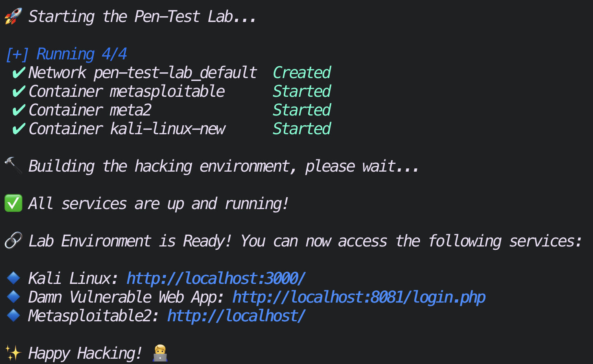

# 🚀 Pen Test Lab - Easily Deployable Pentesting Environment

Welcome to **Pen Test Lab** – an easily deployable pentesting environment leveraging Docker containers. This project provides an accessible, pre-configured environment with **Kali Linux**, **Damn Vulnerable Web Application (DVWA)**, and **Metasploitable2**, running through your browser for easy testing and learning.

## 🎯 Project Aim

The goal of this project is to provide a simplified way to deploy a penetration testing lab with all tools readily available. By utilizing Docker, the setup is **portable**, **customizable**, and ideal for **security researchers**, **ethical hackers**, and **learners**.

## 👍 Features

- **Kali Linux**: Pre-installed with pentesting tools and running through the browser.
- **Damn Vulnerable Web Application (DVWA)**: Web-based application with multiple security flaws for testing.
- **Metasploitable2**: A vulnerable Linux VM ideal for practicing Metasploit.
- **Accessible Links**: All services are available via your local browser.
- **Easy Start**: One command to start the whole environment with easy-to-access links.

---

## 📂 Project Structure

```bash
pen-test-lab/
│
├── docker-compose.yml        # Defines services (Kali Linux, DVWA, Metasploitable)
├── .gitignore                # Ignore unnecessary files
├── README.md                 # Project documentation (you are here)
├── start_lab.sh              # Script to start the environment and display links
├── config/                   # Configuration files for services
```

## 🧰 Installation and Setup

### Clone the Repository

```bash
git clone https://github.com/richardwaters9049/pen-test-lab.git
cd pen-test-lab
```

### Start the Environment

```bash
./start.sh
```

### Output


